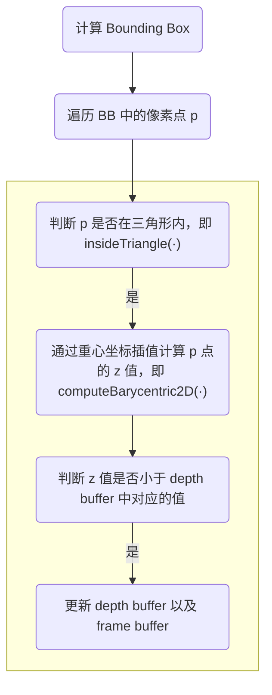

### GAMES101 作业2

#### 绘制流程



#### 判断某一点是否在三角形内

##### 平面中的判断原理

仅考虑二维情况，我们可以简单地通过向量叉积的方式快速判断一个点是否在三角形中。具体地，如下右图所示，**如果点 $p$ 在三角形 $\Delta_{abc}$ 内，我们从 $a$ 点出发，沿着固定的方向（逆时针/顺时针）在三条边行走时，点 $p$ 应该始终在我们身体的同一侧**。因此，为了判断点 $p$ 是否在三角形 $\Delta_{abc}$ 内，可以将三角形的顶点 $abc$ 按顺序连接起来，形成三个向量 $\vec{ab}$、$\vec{bc}$、$\vec{ca}$。然后再以每个顶点为基准，获得向量$\vec{ap}$、$\vec{bp}$、$\vec{cp}$，**判断三组对应向量的叉积是否同号**，若同号则点在三角形内，否则不在。例如下图所示，如果 $p$ 在三角形 $\Delta_{abc}$ 内，那么由叉乘的性质（右手定则），会有 $\vec{ab}×\vec{ap}>0$ 。同理，会有$\vec{bc}×\vec{bp}>0$，$\vec{ca}×\vec{cp}>0$。而如果 $p$ 在三角形外，比如 $p’$ 点，则有 $\vec{ab}×\vec{ap'}<0$。

|  |  |
| :----------------------------------------------------------: | :----------------------------------------------------------: |
|               光栅化时可以先确定包围盒再做判断               |                    判断点Q是否在三角形中                     |

##### 代码实战

```c++
static bool insideTriangle(float x, float y, const Vector3f* _v)
{   
    // TODO : Implement this function to check if the point (x, y) is inside the triangle represented by _v[0], _v[1], _v[2]
    Vector3f ab = _v[1] - _v[0];
    Vector3f bc = _v[2] - _v[1];
    Vector3f ca = _v[0] - _v[2];
    ab.z() = bc.z() = ca.z() = 0;
    
    Vector3f p(x, y, 0);
    Vector3f ap = p - _v[0];
    Vector3f bp = p - _v[1];
    Vector3f cp = p - _v[2];
    ap.z() = bp.z() = cp.z() = 0;

    Vector3f ap_ab = ap.cross(ab);
    Vector3f bp_bc = bp.cross(bc);
    Vector3f cp_ca = cp.cross(ca);

    bool isInside = (ap_ab.z() >= 0 && bp_bc.z() >=0 && cp_ca.z()>=0) 
        || (ap_ab.z() < 0 && bp_bc.z() < 0 && cp_ca.z() < 0);
    
    return isInside;
}
```

#### 重心坐标插值

##### 什么是重心坐标？

Barycentric coordinates（重心坐标）是指用**三个有序点所构成的三角形中的一点对每个端点的比例来描述该点的坐标的一种坐标系**。 

在一个三角形ABC中，点P的重心坐标 $(u, v, w)$ 表示为：$P = uA + vB + wC$，其中 $u+v+w=1$， 且 $u、v、w≥0$。

因此，**重心坐标意味着P点相对于三角形ABC的重心的比例**。重心坐标在计算机图形学和三角形网格的处理中有广泛的应用。

重心坐标系针对特定三角形，每个三角形都有一套自己的重心坐标系，**为了使得该重心坐标系内的点都是三角形顶点的一个线性组合，必须满足 α + β + γ = 1 ，同时，为了将点限制在三角形内部，线性组合系数需要满足 (α≥0, β≥0, γ≥0)**。

|  |  |
| :----------------------------------------------------------: | :----------------------------------------------------------: |
|       当某一点的重心坐标都不小于0时，该点位于三角形内        |            重心坐标值对应了各部分占总三角形的比重            |

值得注意的是，**当我们将三维空间中的一个点投影到二维平面上时，该点的重心坐标会发生变化**。这是因为投影涉及将点从高维空间转换为低维空间，会导致一个压缩效应。结果，投影点与三角形顶点之间的距离比率会发生变化，而重心坐标也会发生变化。换句话说，重心坐标取决于定义它们的参考系，因此在投影时不能保持不变。这意味着在使用重心坐标表示点时，重要的是考虑它们所在的上下文，并确保投影不会影响坐标的预期解释。比如，**三维空间中的属性要在三维空间中做插值**，因为投影后重心的位置会变化。

##### 重心坐标的求解

重心坐标系的建立过程如下左图所示：假设以 $A$ 为原点，$\overrightarrow{AB}$ 和 $\overrightarrow{AC}$ 为坐标轴，建立坐标系。

原坐标系下任一点 $P(x,y)$ 在三角形 $\Delta_{ABC}$ 的重心坐标系下的坐标值 $(\alpha,\beta,\gamma)$ 可以通过下右图所示的公式计算。公式推导如下。
$$
\alpha=\frac{A_A}{A_A+A_B+A_C}=\frac{|\overrightarrow{PA}\times\overrightarrow{PB}|}{|\overrightarrow{AB}\times\overrightarrow{AC}|},\quad \beta=\frac{|\overrightarrow{PA}\times\overrightarrow{PC}|}{|\overrightarrow{AB}\times\overrightarrow{AC}|},\quad \gamma=1-\alpha-\beta
$$

|  |  |
| :----------------------------------------------------------: | :----------------------------------------------------------: |
|                       重心坐标系的建立                       |               重心坐标系下，求解任意一点的坐标               |

##### 代码实战

```c++
static std::tuple<float, float, float> computeBarycentric2D(float x, float y, const Vector3f* v)
{
    float c1 = (x*(v[1].y() - v[2].y()) + (v[2].x() - v[1].x())*y + v[1].x()*v[2].y() - v[2].x()*v[1].y()) / (v[0].x()*(v[1].y() - v[2].y()) + (v[2].x() - v[1].x())*v[0].y() + v[1].x()*v[2].y() - v[2].x()*v[1].y());
    float c2 = (x*(v[2].y() - v[0].y()) + (v[0].x() - v[2].x())*y + v[2].x()*v[0].y() - v[0].x()*v[2].y()) / (v[1].x()*(v[2].y() - v[0].y()) + (v[0].x() - v[2].x())*v[1].y() + v[2].x()*v[0].y() - v[0].x()*v[2].y());
    float c3 = (x*(v[0].y() - v[1].y()) + (v[1].x() - v[0].x())*y + v[0].x()*v[1].y() - v[1].x()*v[0].y()) / (v[2].x()*(v[0].y() - v[1].y()) + (v[1].x() - v[0].x())*v[2].y() + v[0].x()*v[1].y() - v[1].x()*v[0].y());
    return {c1,c2,c3};
}
```

#### 【TODO】超采样

```c++
float offset_x[4] = { 0.25, 0.25, 0.75, 0.75 };
float offset_y[4] = { 0.25, 0.75, 0.25, 0.75 };
for (int i = 0; i < 4; i++) {
    float tx = (float)x + offset_x[i];
    float ty = (float)y + offset_y[i];

    if (!insideTriangle(tx, ty, t.v)) continue;

    // If so, use the following code to get the interpolated z value.
    auto [alpha, beta, gamma] = computeBarycentric2D(tx, ty, t.v);
    float w_reciprocal = 1.0 / (alpha / v[0].w() + beta / v[1].w() + gamma / v[2].w());
    float z_interpolated = alpha * v[0].z() / v[0].w() + beta * v[1].z() / v[1].w() + gamma * v[2].z() / v[2].w();
    z_interpolated *= w_reciprocal;

    // TODO : set the current pixel (use the set_pixel function) to the color of the triangle (use getColor function) if it should be painted.
    z_interpolated = 1 - z_interpolated;
    if (z_interpolated < sample_depth_buf[get_index(x, y)][i]) {
        sample_depth_buf[get_index(x, y)][i] = z_interpolated;
        sample_frame_buf[get_index(x, y)][i] = t.getColor();
    }
}
Vector3f tc(0, 0, 0);
for (int i = 0; i < 4; i++) {
	tc += 0.25 * sample_frame_buf[get_index(x, y)][i];
}
set_pixel(Vector3f(x, y, 0), tc);
```

#### 参考链接

[GAMES101: 现代计算机图形学入门 (ucsb.edu)](https://sites.cs.ucsb.edu/~lingqi/teaching/games101.html)

[GAMES101-作业1、作业2、作业3的解题和框架分析 - 知乎 (zhihu.com)](https://zhuanlan.zhihu.com/p/425153734)

[图形学随笔：三角形重心坐标推导 - 知乎 (zhihu.com)](https://zhuanlan.zhihu.com/p/429775907)

[判断点是否在三角形内 - 翰墨小生 - 博客园 (cnblogs.com)](https://www.cnblogs.com/graphics/archive/2010/08/05/1793393.html)

[用向量叉乘快速判断点在三角形内外原理与代码_叉乘判断点是否在三角形内_zeeq_的博客-CSDN博客](https://blog.csdn.net/weixin_44120025/article/details/123830197)

---

### GAMES101 作业3

#### 【TODO】图形渲染管线

<details>
    <summary>折叠块标题</summary>
     固定渲染管线<本章的核心，前面仅需了解即可> 在我们的图形几何学上有了3D场景及摄像机，最后我们还需要将它们转换成2D 图形来显示在屏幕上。这就是固定渲染管线所作的工作。 实际上D3D的渲染管线大部分工作都是在做图形变换。D3提供了一个简便的函数 g_pDevice->SetTransform(变换类型，变换矩阵)。 下边我们一起回顾或者学习一下D3D的渲染流水线的理论细节：
​        1、本地空间 说白了就是建模空间(美工建模，或者你在本地组织三角形的组织方式)
​        2、世界空间 通过平移旋转缩放将那些本地空间的物体转换成世界空间内的物体，以 实现场景的组织。D3D提供了一个位置变换的函数D3DXMaterxTranslation； 旋转函数D3DXMaterxRoationX/Y/Z/Axis;缩放函数D3DXMaterxScalling。具体 请你参阅DXAPI。
​        3、视图空间(即摄像机空间) 世界空间中的几何图和摄像机的位置是相对于世界坐标而定义的。但是有 一个缺陷是如果摄像机的位置在世界空间中的位置不是确定的或者死板的，那 通过该摄像机去观察物体那是非常难于控制和低效的。在这种尴尬局面下，诞 生了视图空间这个概念！我们这样操作摄像机，首先将摄像机移至世界空间的 原点，然后旋转摄像机，让它的正方向与世界空间的Z方向一致。这样当你再移 动或者旋转摄像机的时候，世界空间中的几何图就会随着摄像机的变化而做相 同的变化。使其变得顺其自然，而不是被动的啦！ D3D同样为我们提供了一个简便的函数D3DXMatriLookAtLH。
​       4、背面拣选 D3D通过背面拣选方式剔除(即删除多余的处理过程)无用的背面多边形，来 提高程序的执行效率。 D3D默认的顶点是以顺时针组织的多边形为该多边形的正面。 D3D同样给我们提供了一个函数来做这项工作： g_Device->SetRendState(D3DRS_CULLMODE，Value)。默认的是D3DCULL_CCW。
​       5、光照 光照的定义是在世界空间中定义的，并不是在视图空间定义的。但是视图空间 将这些点弄的非常真实。
​       6、裁剪 超出凭借台体的部分几何图将被无情裁剪，借此提高程序执行的效率跟性能。
​        7、投影 投影的作用就是将3D场景转换成2D图像，然后转到投影窗口上去。 这种从n维到n-1维的过程就叫投影。游戏开发中用到的投影是透视投影。 因为透视投影可以使远离摄像机的图形在屏幕上显示的时候也变小，这使得 我们的效果更加逼真的转换成2D图像。 D3D同样也给我们一个简便的投影变换矩阵：D3DXMaterxPerspectiveFovLH。
​       8、视口变换 视口变换就是将投影窗口变换为屏幕上一个矩形区域的可靠变换，这个矩形区域 就是所谓的视口。 D3D中有一个结构体帮助我们设定视口的相关属性D3DVIEWPORT9结构；并且D3D还 给我们提供了另外一个重要的函数g_pDevice->SetViewPort(D3DVIEWPORT结构的一个 变量地址)。 对于视口变换的矩阵的相关重要知识点下节进行重要分析。
​       9、光珊化处理 经过视口变换这些个图像就到屏幕上去了。光栅化所处理的是计算需要显示的每个 三角形中每个点的像素值。它总是应该通过硬件来进行处理，因为它太过于繁琐了如果 微软自己编码处理的话。 在计算完了像素值之后呢，它就将这个成形的2D图像凸现出来啦！
​    说了这么多，我感觉最后需要总结一下子，你觉得呢？ 本章重点阐述了D3D的固定渲染流水线。涉及9小点，那你如何记忆呢？ 还是之前说的D3D初始化那个记忆方法： 分为3个流程：
设计 --- 生产 --- 显示
设计：本地 ---> 世界 -->视图空间(摄像机空间) --> 拣选 -->光照 ---> 裁剪(超出平截台体的部分)
生产：按照以上设计的规格进入生产流程 --> 投影(将设计中的3D物体转换成现实的2D图像，并转到投影上去) --->视口变换(将2D图像映射到屏幕的某个区域内，给他提供可供显示的空间)
显示： 光栅化处理
批注： 光栅化做了什么什么事情: 光栅化就是把矢量的图形像素化,比如说3个顶点组成的一个三角形把它转化为屏幕上的像素的过程。 简单的说，就是把要显示的东西，显示在显示器上过程(给图像加颜色实际上)。
</details>


#### 法线向量变换

法线向量不是一直存在于世界坐标空间之中吗，为什么要去变换他呢？其实原因很简单，因为**模型变换**可能会导致模型位置形状发生改变，如果属于该模型的各个三角形面的法线向量不跟着改变的话，那么此时所记录的法线向量就是错误的。因此法线向量一定也要跟着模型本身发生改变。

那么是否简单的将作用在模型本身的变换也作用在对应的法线向量之上就可以了呢？答案是否定的。如下图所示，一个简单矩形经过一个剪切变换 $\mathbf{M}$ 之后，不难发现矩形右边的法线向量没有改变，而与变换矩阵 $\mathbf{M}\cdot\mathbf{n}$ 得到的结果不相符。

|  |  |
| :----------------------------------------------------------: | :----------------------------------------------------------: |
|                       坐标系变换流程图                       |        示例：将同样的变换应用到法向量上可能会导致错误        |

##### 法线向量变换公式推导

假设 $\mathbf{t}$ 是原平面上的任一向量，则有 $\mathbf{n}^T \cdot \mathbf{t}=\mathbf{0}$ 。记变换矩阵为 $\mathbf{M}$ ，有
$$
\mathbf{n}^T\cdot\mathbf{t}=\mathbf{n}^T\cdot\mathbf{M}^{-1}\cdot\mathbf{M}\cdot\mathbf{t}=(\mathbf{n}^T\cdot\mathbf{M}^{-1})\cdot(\mathbf{M}\cdot\mathbf{t})=
\mathbf{0} \\
\Longrightarrow\quad \mathbf{n'}^T=\mathbf{n}^T\cdot\mathbf{M}^{-1} \\
\Longrightarrow\quad \mathbf{n'}=(\mathbf{M}^{-1})^T\cdot\mathbf{n}
$$
由此，我们推导出变换后的 $\mathbf{n'}$ 的表达式，即**在使用变换矩阵为 $\mathbf{M}$ 对顶点做变换时，我们需要同时对法向量施加变换 $(\mathbf{M}^{-1})^T$**。

##### 代码实战

```c++
// Correct Normal
Eigen::Matrix4f inv_trans = (view * model).inverse().transpose();
Eigen::Vector4f n[] = {
    inv_trans * to_vec4(t->normal[0], 0.0f),
    inv_trans * to_vec4(t->normal[1], 0.0f),
    inv_trans * to_vec4(t->normal[2], 0.0f)
};
```

#### Z-buffer 与 W-buffer

> 以下内容引用自 [详细介绍Z-Buffer与W-Buffer-阿里云开发者社区 (aliyun.com)](https://developer.aliyun.com/article/49272) 。

Depth-Buffer（深度缓存）有两种：Z-Buffer 和 W-Buffer，这里讨论这两种深度缓存的区别，以及如何在两者之间转换。

##### w 的含义

3D空间点的坐标是 $(x,y,z)$，为了使矩阵乘法具有平移变换的功效，我们用4D空间中的点 $(x,y,z,w)$ 来表示3D空间中的点 $(x'，y'，z')$ ，这两个不同空间点之间的关系是：
$$
x'=\frac{x}{w},\quad y'=\frac{y}{w},\quad z'=\frac{z}{w}
$$
像这样用四维空间点表示三维空间点，或者说用 $n + 1$ 维空间点表示 $n$ 维空间点的方法叫做 “齐次坐标表示法”。

实际使用中，在模型->世界转换、世界->视图转换过程中，$w$ 通常保持不变，总是等于 $1$，这样，齐次坐标的前三个分量就是对应3D空间点的三个坐标分量。但是，经过**透视投影变换后，$w$ 将得到一个比例值**，比如，一般的透视投影变换矩阵是：
$$
\begin{matrix}
W & 0 & 0 & 0\\
4 & H & 6 & 0\\
7 & 8 & Q & 1\\
0 & 0 & -QZ_n &0
\end{matrix}
$$

其中　 $Z_n$ 为近裁剪面 $z$ 坐标，$Z_f$ 为远裁剪面 $z$ 坐标，$W=2 \cdot Z_n / 视口宽度$ ，$H=2 \cdot Z_n / 视口高度$，$Q=Z_f / (Z_f - Z_n)$ 。

将点 $(x,y,z,1)$ 乘以此矩阵，$w$ 便不再是 $1$ ，而对应的3D空间点坐标 $(x / w,y / w,z / w)$ （这种计算也被称为**透视除法**）将出现一个缩放效果。同时，因为 $w$ 的值通常与 $z$ 坐标成正比（比如经过上面这个矩阵的变换，$w$ 的值其实就是 $z$ 坐标的值），所以经过投影变换，物体会产生近大远小的效果。

##### Z-Buffer 与 W-Buffer 的区别

简单的说，z-buffer 与 w-buffer 的区别就是前者保存的是点的 $z$ 坐标，而后者保存的是点的 $w$ 坐标。具体的说，两者因为保存的值有不同的含义，所以表现出来的实际效果也会有差别。

z-buffer 保存的是经过投影变换后的 $z$ 坐标，前面说过，投影后物体会产生近大远小的效果，所以距离眼睛比较近的地方，$z$ 坐标的分辨率比较大，而远处的分辨率则比较小，换句话说，投影后的 $z$ 坐标在其值域上，对于离开眼睛的物理距离变化来说，不是线性变化的（即非均匀分布），这样的一个好处是近处的物体得到了较高的深度分辨率，但是远处物体的深度判断可能会出错。

w-buffer 保存的是经过投影变换后的 $w$ 坐标，而 $w$ 坐标通常跟世界坐标系中的 z 坐标成正比，所以变换到投影空间中之后，其值依然是线性分布的，这样无论远处还是近处的物体，都有相同的深度分辨率，这是它的优点，当然，缺点就是不能用较高的深度分辨率来表现近处的物体。

从硬件实现角度来说，几乎所有的硬件3D加速卡都支持 z-buffer，而 w-buffer 的支持没有 z-buffer 那么广泛。另外，早期的 Direct3D 版本看起来也不支持 w-buffer。

##### Z-Buffer 与 W-Buffer 之间的转换

根据上面的矩阵变换，可以很容易的导出将 w-buffer 转换成 z-buffer 的公式：
$$
z_{depth}=Q\cdot\frac{(w_{depth}-Z_n)}{w_{depth}}=\frac{Z_f}{Z_f-Z_n}\cdot\frac{(w_{depth}-Z_n)}{w_{depth}}
$$
这个转换公式有什么用处？举个例子：3DS MAX 使用的是 w-buffer，如果从 3DS MAX 中导出深度信息到 Direct3D 中，作为预渲染的背景使用，就有可能用到上面这个转换。当然，如果在 D3D 中使用 w-buffer，问题就不大了，但是如果使用 z-buffer，不经过这样的转换，渲染结果就会出错。

#### 透视矫正插值

如作业二中所介绍的，我们的重心坐标往往都是在屏幕空间下所得到的，如果直接使用屏幕空间下的重心坐标进行插值会造成一定的误差，与在view space下是不一样的，那么本节内容就会具体介绍如何矫正这种误差，利用屏幕空间下的重心坐标达到正确的插值。

##### 透视矫正的推导

为了证明的简便性，我们利用深度值 $Z$ 的线性插值进行说明，重心坐标插值可以类比得到。该问题可以很简单在下左图之中表现出来，简单叙述一下，在屏幕空间进行线性插值得到点 $c$ 的intensity为0.5，然而对于在view space之中正确的插值结果，可以很明显看到 $C$ 的intensity绝不为0.5。这也就造成了插值的误差，应该去矫正！

|  |  |
| :----------------------------------------------------------: | :----------------------------------------------------------: |
|                   透视投影前后插值结果不同                   |                        线性插值的推导                        |

首先先分别定义屏幕空间的比例为 $s$，view space中为 $t$，其余符号含义如上右图所示。为了简便证明，将点的坐标用2维表示，第一维为图中所示的 $x$ 轴，第二维为 $z$ 轴。 简而言之，我们的目标就是得出 $t$ 与 $s$ 的关系式，这样就可以正确的利用屏幕空间的系数 $s$ 插值到正确的view space的结果，推导过程如下。

1. 由上图所示的投影所造成的三角形相似性可以轻易得出如下几个式子：
   $$
   \frac{X_1}{Z_1}=\frac{u_1}{d}\quad\Longrightarrow\quad X_1=\frac{u_1}{d}Z
   _1 \\
   \frac{X_2}{Z_2}=\frac{u_2}{d}\quad\Longrightarrow\quad X_2=\frac{u_2}{d}Z
   _2 \\
   \frac{X_t}{Z_t}=\frac{u_s}{d}\quad\Longrightarrow\quad Z_t=\frac{d}{u_s}X_t
   $$

2. 分别利用 screen space 以及 view space的线性插值可以得到以下几个式子：
   $$
   u_s=u_1+s\cdot(u_2-u_1)\\
   X_t=X_1+t\cdot(X_2-X_1)\\
   Z_t=Z_1+t\cdot(Z_2-Z_1)
   $$

3. 联立上式，可以推出 $t$ 与 $s$ 的关系式：
   $$
   Z_t=\frac{d}{u_s}X_t=\frac{d}{u_1+s\cdot(u_2-u_1)}(X_1+t\cdot(X_2-X_1))\\
   =\frac{d}{u_1+s\cdot(u_2-u_1)}(\frac{u_1}{d}Z
   _1+t\cdot(\frac{u_2}{d}Z
   _2-\frac{u_1}{d}Z
   _1))\\
   \Longrightarrow Z_1+t\cdot(Z_2-Z_1)=\frac{u_1Z_1+t\cdot(u_2Z_2-u_1Z_1)}{u_1+s\cdot(u_2-u_1)}\\
   \Longrightarrow t=\frac{sZ_1}{sZ_1+(1-s)Z_2}
   $$

4. 将 $t$ 与 $s$ 的关系式代入到 $Z_t$ 的线性插值式子中，可以得到下式。可以看出，深度值的倒数是线性变换的。
   $$
   Z_t=Z_1+t\cdot(Z_2-Z_1)=Z_1+\frac{sZ_1}{sZ_1+(1-s)Z_2}(Z_2-Z_1) \\
   \Longrightarrow \frac{1}{Z_t}=\frac{1-s}{Z_1}+\frac{s}{Z_2}=\frac{1}{Z_1}+s(\frac{1}{Z_2}-\frac{1}{Z_1})
   $$

5. 至此，我们得到了利用屏幕空间下的系数进行正确地线性插值的公式。对于重心坐标插值来说，我们可以类似地推出：
   $$
   \frac{1}{Z_t}=\frac{\alpha}{Z_A}+\frac{\beta}{Z_B}+\frac{\gamma}{Z_C} \quad\Longleftrightarrow\quad Z_t=\frac{1}{\frac{\alpha}{Z_A}+\frac{\beta}{Z_B}+\frac{\gamma}{Z_C}}
   $$

6. 进一步地，对于深度值之外的任意属性 $I$（法线向量、纹理坐标等）的插值，我们同样先以线性插值为例，进行推导：
   $$
   I_t=I_1+t\cdot(I_2-I_1)=I_1+\frac{sZ_1}{sZ_1+(1-s)Z_2}(I_2-I_1)\\
   \Longrightarrow\quad \frac{I_t}{Z_t}=(1-s)\frac{I_1}{Z_1}+s\frac{I_2}{Z_2}
   $$
   上式的化简：先通分，然后分式上下同时除以 $Z_1Z_2$ 即可。

7. 由上式我们可以得出，**在投影变换前后，任意的属性 $I$ 与深度值的比值 $\frac{I}{Z}$ 是线性变化的**，类似地，我们可以得到任意属性的重心坐标插值公式：
   $$
   \frac{I_t}{Z_t}=\alpha\frac{I_A}{Z_A}+\beta\frac{I_B}{Z_B}+\gamma\frac{I_C}{Z_C} \quad\Longrightarrow\quad I_t=\frac{1}{\frac{\alpha}{Z_A}+\frac{\beta}{Z_B}+\frac{\gamma}{Z_C}}\cdot(\alpha\frac{I_A}{Z_A}+\beta\frac{I_B}{Z_B}+\gamma\frac{I_C}{Z_C})
   $$


##### 代码实战

```c++
// * v[i].w() is the vertex view space depth value z.
// * w_reciprocal is interpolated view space depth for the current pixel
// * z_interpolated is depth between zNear and zFar, used for z-buffer
auto [alpha, beta, gamma] = computeBarycentric2D(x, y, t.v);
float w_reciprocal = 1.0 / (alpha / v[0].w() + beta / v[1].w() + gamma / v[2].w());
float z_interpolated = alpha * v[0].z() / v[0].w() + beta * v[1].z() / v[1].w() + gamma * v[2].z() / v[2].w();
z_interpolated *= w_reciprocal;

// TODO: Interpolate the attributes:
auto interpolated_color = interpolate(alpha, beta, gamma, t.color[0], t.color[1], t.color[2], 1 / w_reciprocal);
auto interpolated_normal = interpolate(alpha, beta, gamma, t.normal[0], t.normal[1], t.normal[2], 1 / w_reciprocal);
auto interpolated_texcoords = interpolate(alpha, beta, gamma, t.tex_coords[0], t.tex_coords[1], t.tex_coords[2], 1 / w_reciprocal);
auto interpolated_shadingcoords = interpolate(alpha, beta, gamma, view_pos[0], view_pos[1], view_pos[2], 1 / w_reciprocal);

static Eigen::Vector3f interpolate(float alpha, float beta, float gamma, const Eigen::Vector3f& vert1, const Eigen::Vector3f& vert2, const Eigen::Vector3f& vert3, float weight)
{
    return (alpha * vert1 + beta * vert2 + gamma * vert3) / weight;
}

static Eigen::Vector2f interpolate(float alpha, float beta, float gamma, const Eigen::Vector2f& vert1, const Eigen::Vector2f& vert2, const Eigen::Vector2f& vert3, float weight)
{
    auto u = (alpha * vert1[0] + beta * vert2[0] + gamma * vert3[0]);
    auto v = (alpha * vert1[1] + beta * vert2[1] + gamma * vert3[1]);

    u /= weight;
    v /= weight;

    return Eigen::Vector2f(u, v);
}
```

#### 局部光照模型

局部光照模型其实是材质模型的一类。材质模型是用来描述物体表面性质的模型，包括材料的颜色、纹理、反光度、光泽度、透明度等。不同的材质会对入射光线产生不同的反应，从而影响到物体表面的光照效果。计算机图形学中常用的材质模型有经典的Lambert模型、Phong模型、Blinn-Phong模型等。

##### 泛光模型

泛光模型，是最简单的经验模型，**只考虑环境光的影响**，且不会去精确地描述环境光的影响（区别于PBR模型）。泛光模型的数学表达式如下。
$$
L_a=k_aI_a
$$
其中，$k_a$ 代表物体表面对环境光的反射率，$I_a$ 代表入射环境光的亮度，$L_a$ 存储结果，即人眼所能看到从物体表面反射的环境光的亮度。

##### Lambert 模型

Lambert模型是一种经典的漫反射模型，它是最简单和最常用的一个漫反射模型之一。Lambert 模型在泛光模型的基础之上增加了**漫反射项**。漫反射现象指光线遇到粗糙表面时，被反射到不同方向而形成的现象。具体来说，当光线照射到一个粗糙表面时，光线会被折射，反射和散射到各个方向，形成一个弥散的光谱，这种反射就被称为漫反射。漫反射光线在眼中看起来是均匀的光亮，从而使物体表面的细节和形状更加清晰可见。

|  |  |
| :----------------------------------------------------------: | :----------------------------------------------------------: |
|                       漫反射现象示意图                       |                                                              |

Lambert 模型假设光在撞击物体表面时会形成一个**均匀的亮度**，其亮度**与光源和物体表面之间的角度成正比**。这个角度是入射光线的反向和表面法向量之间的夹角。

数学表达式可以表示为：
$$
L_d =   k_d \cdot \frac{I}{r^2} \cdot \max(0,\cos\theta) = k_d \cdot \frac{I}{r^2} \cdot \max(0,\mathbf{n}\cdot\mathbf{l})
$$
其中，$L_d$ 是表面的辐射亮度，$I$ 是光源的辐射强度，$k_d$ 是表面的反射常数，$\cos\theta$ 是入射光线与法向量的夹角。

Lambert 模型考虑了光照传输过程中的两种损失：

- 入射角度。如下左图所示，只有当入射光线与平面垂直的时候才能完整的接受所有光的能量，而入射角度越倾斜损失的能量越大。这对应了上式中的 $\cos\theta$ 项。
- 传输距离。如下右图所示，图中中心为一个点光源，光线均匀的向周围发射，可以想象光源发射出来的能量其实是一定的，那么在任意两个圈上接受到的能量之和相等。因此，光照随距离呈平方衰减，这对应了上式中的 $\frac{I}{r^2}$ 项。

|  |  |
| :----------------------------------------------------------: | ------------------------------------------------------------ |
|               入射角度造成的表面接收到能量损失               | 光源与照射点的距离造成的能量损失                             |


该模型假设物体表面是完全哑面，并忽略了表面材料的反射特性。虽然这个模型非常简单，但它在许多计算机图形学和渲染技术中使用广泛，因为它可以方便地计算，而且效果也还不错。

##### Phong 模型

Phong 模型在 Lambert 漫反射模型的基础上，添加了高光（specular）项，可以表现良好的类镜面反射现象。其数学表示式如下：
$$
L_s=k_s\cdot\frac{I}{r^2}\cdot\max(0,\cos\alpha)^p=k_s\cdot\frac{I}{r^2}\cdot\max(0,\mathbf{R}\cdot\mathbf{v})^p
$$
其中 $k_s$ 为镜面反射系数，$I$ 为入射光强，$r^2$ 为光源到入射点距离，$\alpha$ 为反射向量 $\mathbf{R}$ 与观察向量 $\mathbf{v}$ 的夹角，注意这里在 $\max(\cdot)$ 剔除大于90°的光之后，Phong模型还添加了指数 $p$ ，以控制高光的衰减速度，如下右图所示。

|  |  |
| :----------------------------------------------------------: | :----------------------------------------------------------: |
|                       Phong 模型示意图                       |                    通过指数项控制衰减速度                    |

下面推导一下Phong 模型中用到的反射向量 $\mathbf{R}$ 的计算式。如上左图所示，法向量 $\mathbf{n}$ 、入射向量 $\mathbf{l}$ 、反射向量 $\mathbf{R}$ 与 观察向量 $\mathbf{v}$ 均为单位向量。根据等腰三角形的性质等几何原理，有：
$$
\mathbf{R}=\vec{OA}-\mathbf{l}=2\cdot\operatorname{Proj}_\mathbf{n}\mathbf{l}-\mathbf{l}=2\cdot\frac{\mathbf{l}\cdot\mathbf{n}}{||\mathbf{n}||^2}\cdot\mathbf{n}-\mathbf{l}\\
\Longrightarrow\quad \mathbf{R}=2(\mathbf{l}\cdot\mathbf{n})\mathbf{n}-\mathbf{l}
$$

##### Blinn-Phong 模型

Phong 模型不仅对真实光照有很好的近似，而且性能也很高。但是它的镜面反射会在一些情况下出现问题，特别是物体反光度很低时，会导致大片（粗糙的）高光区域。如下左图所示，Phong 模型的渲染结果在镜面高光区域的边缘出现了一道很明显的断层。出现这个问题的原因是观察向量和反射向量间的夹角大于90°时，点积的结果为负数，镜面光分量会变为0，也就是下右图中的情况。

|  |  |
| :----------------------------------------------------------: | :----------------------------------------------------------: |
|                  镜面高光区域的边缘出现断层                  |              观察向量和反射向量间的夹角大于90度              |

这在大多数情况下都不是什么问题，因为观察方向离反射方向都非常远。然而，当物体的反光度非常小时，它产生的镜面高光半径足以让这些相反方向的光线对亮度产生足够大的影响。在这种情况下就不能忽略它们对镜面光分量的贡献了。

1977年，James F. Blinn在冯氏着色模型上加以拓展，引入了Blinn-Phong着色模型。Blinn-Phong模型与冯氏模型非常相似，但是它对镜面光模型的处理上有一些不同，让我们能够解决之前提到的问题。Blinn-Phong模型不再依赖于反射向量，而是采用了所谓的**半程向量(Halfway Vector)**，即光线与视线夹角一半方向上的一个单位向量。当半程向量与法线向量越接近时，镜面光分量就越大。

|  |  |
| :----------------------------------------------------------: | :----------------------------------------------------------: |
|                       断层现象得到改善                       |                   使用半程向量与法向量夹角                   |

当视线正好与（现在不需要的）反射向量对齐时，半程向量就会与法线完美契合。所以当观察者视线越接近于原本反射光线的方向时，镜面高光就会越强。现在，不论观察者向哪个方向看，半程向量与表面法线之间的夹角都不会超过90度（除非光源在表面以下）。它产生的效果会与 Phong 模型有些许不同，但是大部分情况下看起来会更自然一点，特别是低高光的区域。Blinn-Phong 着色模型正是早期固定渲染管线时代时OpenGL所采用的光照模型，其数学表达式如下。
$$
L_s=k_s\cdot\frac{I}{r^2}\cdot\max(0,\mathbf{n}\cdot\mathbf{h})^p,\quad \mathbf{h}=\frac{\mathbf{v}+\mathbf{l}}{||\mathbf{v}+\mathbf{l}||}
$$
值得注意的是，半程向量与表面法线的夹角通常会小于观察与反射向量的夹角。所以，如果你想获得和冯氏着色类似的效果，就必须在使用 Blinn-Phong 模型时将镜面反光度设置更高一点。通常我们会选择冯氏着色时反光度分量的2到4倍。另外，Blinn-Phong 模型的计算复杂度也低于 Phong 模型。

##### 局部光照模型总结

- **泛光模型**
  $$
  L_a=k_aI_a
  $$

- **Lambert 模型**
  $$
  L_r=k_aI_a+k_d\cdot\frac{I}{r^2}\cdot\max(0,\mathbf{n}\cdot\mathbf{l})
  $$

- **Phong 模型**
  $$
  L_r=k_aI_a+k_d\cdot\frac{I}{r^2}\cdot\max(0,\mathbf{n}\cdot\mathbf{l})+k_s\cdot\frac{I}{r^2}\cdot\max(0,\mathbf{R}\cdot\mathbf{v})^p,\quad \mathbf{R}=2(\mathbf{l}\cdot\mathbf{n})\mathbf{n}-\mathbf{l}
  $$

- **Blinn-Phong 模型**
  $$
  L_r=k_aI_a+k_d\cdot\frac{I}{r^2}\cdot\max(0,\mathbf{n}\cdot\mathbf{l})+k_s\cdot\frac{I}{r^2}\cdot\max(0,\mathbf{n}\cdot\mathbf{h})^p,\quad \mathbf{h}=\frac{\mathbf{v}+\mathbf{l}}{||\mathbf{v}+\mathbf{l}||}
  $$

#### 着色方法

在前文中，已经介绍了局部光照模型的基本原理，其中利用了入射向量、法线向量以及观察向量之间的关系来建模光线的反射特性。然而，并未明确指出法线向量是三角形面的法线向量还是三角形顶点的法线向量。因此，这引出了本节的主题——着色频率，包括面着色、顶点着色与像素着色。分别对应了三种不同的着色方法，Flat Shading、Gouraud Shading 与 Phong Shading。

##### Flat Shading / 面着色

Flat Shading 是一个基本的着色技术，它**使用多边形网格表面的法向量**来确定每个像素的颜色，并且**认为整个多边形表面都是同样的颜色**。这种方法简单快速，但是其几何表现很简陋，表面看上去很平滑，缺乏真实感。

##### Gouraud Shading / 顶点着色

Gouraud Shading 是一种从多边形的顶点开始计算的方法。它通过**在多边形的每个顶点处确定一个法向量**用于着色，并在**多边形内插值颜色**，得到每个像素的颜色。这种方法比 Flat Shading 更加逼真，能够呈现出表面纹理的变化和明暗对比，但是在表面出现锐利边缘时，这种方法就会失真。

具体地，Gouraud Shading 需要解决两个问题：

- 计算多边形每个顶点的法向量。顶点法向量的计算一般有两种情况：

  - 如果多边形的几何表达式已知（如圆形），那么可以直接根据公式计算顶点法向量。

  - 如果仅知道多边形表面的法向量，那么可以将所有共享某顶点的表面的法向量的均值近似作为该顶点的法向量：
    $$
    \mathbf{N_v}=\frac{\sum_i\mathbf{N_i}}{||\sum_i\mathbf{N_i}||}
    $$

- 计算多边形内任一点的颜色。Gouraud Shading 仅对多边形的顶点进行着色计算，多边形内部的颜色值通过使用重心坐标插值得到。（重心插值详细可看之前的笔记。）

|  |  |
| :----------------------------------------------------------: | :----------------------------------------------------------: |
|                  几何表达式已知时可直接求解                  |                    表达式未知时可近似计算                    |

##### Phong Shading / 像素着色

Phong Shading 是 Gouraud Shading 的改进版，具有更高的计算成本。**Phong Shading 利用<u>每个像素的表面法线和每个像素的材质属性</u>计算光照**。使用一系列复杂的算法，Phong Shading 能够创建射线在交汇点处反射、折射等物理现象，使得表面看起来更加真实、更加光滑。Phong Shading 主要运用于渲染真实物体时的光照处理，是计算机图形学中比较流行的表面着色模型之一。

与 Gouraud Shading 的在实现上的不同之处在于，Phong Shading 需要通过重心坐标插值计算每个像素的法向量与材质属性，对每个像素进行单独的着色计算。而 Gouraud Shading 只是对每个顶点进行着色，然后通过重心坐标插值计算每个像素的值。

##### 不同着色方法对比

Phong Shading 和 Gouraud Shading 都是渲染技术中的平滑着色算法，两者各有优劣：

Gouraud Shading 的缺点：

1. 法向量插值精度较低：在 Gouraud Shading 中，法向量是在每个面上计算的，并且每个面上的法向量在共享的顶点处被插值。这会导致一些表面细节丢失，并且对更复杂的物体来说，插值可以导致表面细节变得更加平滑，效果可能不够真实。
2. 镜面反射方向不足：由于各种原因，Gouraud Shading 通常不能产生非常好的镜面反射效果，由于法向量的插值可能导致镜面反射效果看上去不够自然。
3. 不够真实：由于 Gouraud Shading 在顶点上计算光照并插值，可能会导致物体表面看起来有明显的颜色分层，而且在某些情况下，颜色的变化可能不够平滑和自然。

Phong Shading 的优势包括：

1. 准确性更高：Phong Shading 计算每个像素颜色的方式更加准确，因为它是基于每个像素法线的插值来计算光照。这使得这种技术在处理有曲面的物体时效果更好。
2. 可扩展性：Phong Shading 容易扩展成更高效的算法来处理光照效果，例如在不同阶段计算光照的线程化或采用 GPU 加速渲染。
3. 更好的反射效果：Phong Shading 可以产生更好的镜面反射效果，因为它通过对法线向量进行插值来计算每个像素的反射方向，而不是直接使用顶点法线。

Phong Shading 的劣势包括：

1. 计算成本高：相对于 Gouraud Shading，Phong Shading 的计算复杂度更高。它需要计算每个像素的法线向量，然后进行插值，因此它需要更多的计算资源。
2. 边缘过度平滑：由于 Phong Shading 是在每个像素上计算光照的，因此它可能会过度平滑边缘，导致物体外观不够自然。


有一点的要注意的是，这里所有的茶壶所使用的都是一个低精度模型，这点可以从Flat Shading的结果可以看出，面片是有限的。随着模型精度的提升，各种着色方法的实际表现也会有所不同，如下图所示。


#### 纹理映射与Mipmap技术


#### 参考链接

[计算机图形学六：透视矫正插值和图形渲染管线总结 - 知乎 (zhihu.com)](https://zhuanlan.zhihu.com/p/144331875)

[详细介绍Z-Buffer与W-Buffer-阿里云开发者社区 (aliyun.com)](https://developer.aliyun.com/article/49272)

[作业3 interpolated_shadingcoords – 计算机图形学与混合现实在线平台 (games-cn.org)](https://games-cn.org/forums/topic/zuoye3-interpolated_shadingcoords/)

[《GAMES101》作业框架问题详解 - 知乎 (zhihu.com)](https://zhuanlan.zhihu.com/p/509902950)

[ “透视除法” —— 齐次坐标和投影_桑来93的博客-CSDN博客](https://blog.csdn.net/qjh5606/article/details/88614804)

[孙小磊 - 知乎 (zhihu.com)](https://www.zhihu.com/people/sun-lei-22-19/posts)

[高级光照 - LearnOpenGL CN (learnopengl-cn.github.io)](https://learnopengl-cn.github.io/05 Advanced Lighting/01 Advanced Lighting/)

[Direct3D固定渲染流水线分析与总结_警醒与鞭策的博客-CSDN博客](https://blog.csdn.net/Game_jqd/article/details/21377937)

[灰度图、高度图和法线贴图 介绍及原理_高度图 原理_警醒与鞭策的博客-CSDN博客](https://blog.csdn.net/Game_jqd/article/details/82056157)

[⭐  切线空间（Tangent Space）法线映射（Normal Mapping）_警醒与鞭策的博客-CSDN博客](https://blog.csdn.net/Game_jqd/article/details/74858146?spm=1001.2101.3001.6650.1&utm_medium=distribute.pc_relevant.none-task-blog-2~default~CTRLIST~Rate-1-74858146-blog-107917594.235^v27^pc_relevant_t0_download&depth_1-utm_source=distribute.pc_relevant.none-task-blog-2~default~CTRLIST~Rate-1-74858146-blog-107917594.235^v27^pc_relevant_t0_download&utm_relevant_index=2)

