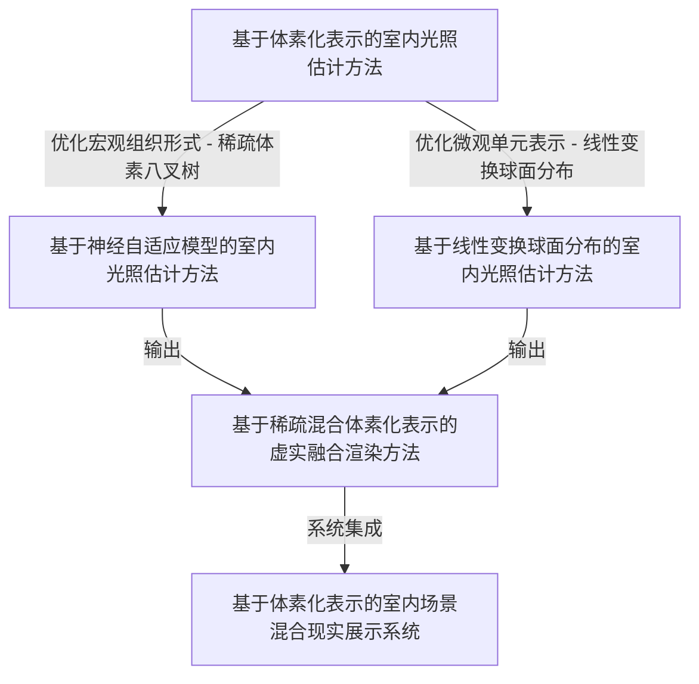
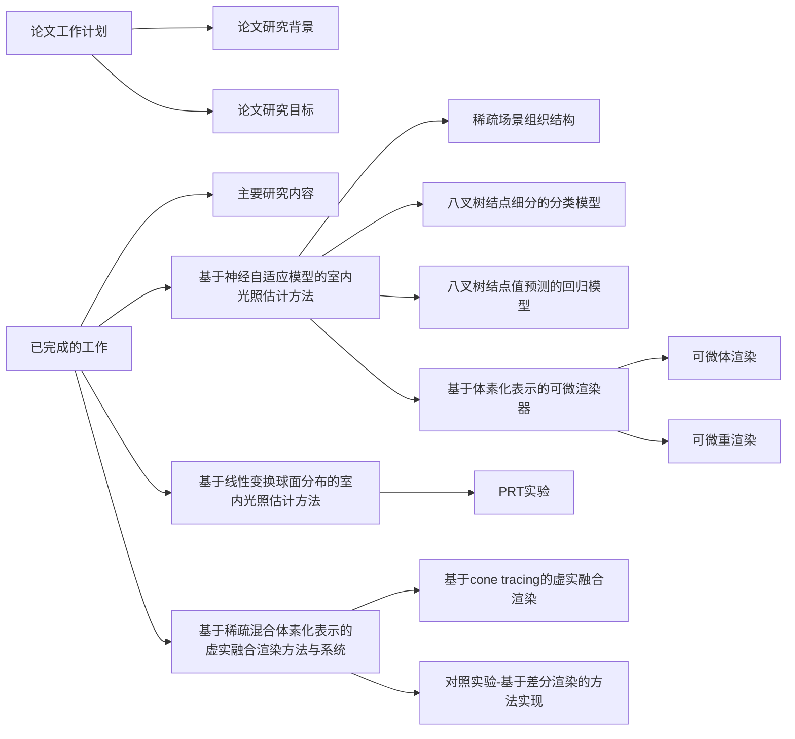

#### lighthouse 网络权重

```
  | Name         | Type     | Params
------------------------------------------
0 | mpi_model    | MPINet   | 2.2 M 
1 | mcube0_model | MCubeNet | 2.2 M 
2 | mcube1_model | MCubeNet | 2.2 M 
3 | mcube2_model | MCubeNet | 2.2 M 
4 | mcube3_model | MCubeNet | 2.2 M 
5 | mcube4_model | MCubeNet | 2.2 M 
6 | vgg_lossfn   | VGGLoss  | 12.9 M
------------------------------------------
13.2 M    Trainable params
12.9 M    Non-trainable params
26.2 M    Total params
104.761   Total estimated model params size (MB)
```

