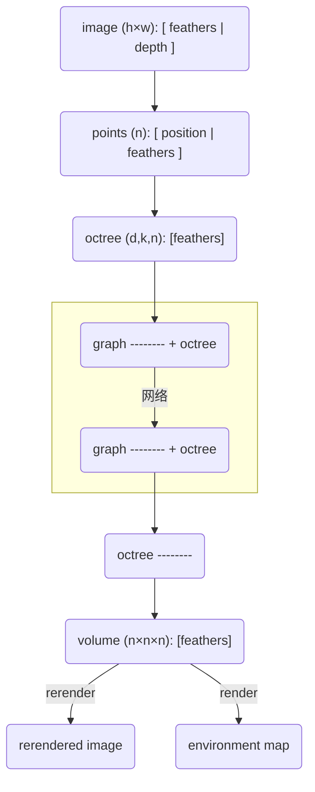

## 流程图

### 数据流图




## 格式转换

### RGBD -> 点云

[单应矩阵的推导与理解 - 知乎 (zhihu.com)](https://zhuanlan.zhihu.com/p/138266214)

[Pybullet获取RGB图像和深度图像构建点云（Open3D）_a_struggler的博客-CSDN博客](https://blog.csdn.net/astruggler/article/details/128918120?spm=1001.2101.3001.6650.2&utm_medium=distribute.pc_relevant.none-task-blog-2~default~CTRLIST~Rate-2-128918120-blog-101462348.235^v27^pc_relevant_t0_download&depth_1-utm_source=distribute.pc_relevant.none-task-blog-2~default~CTRLIST~Rate-2-128918120-blog-101462348.235^v27^pc_relevant_t0_download&utm_relevant_index=5)

[3D机器学习（12）：Open3D学习笔记：RGBD图像转化为点云、点云的体素化_点云体素化_朱攀乖的博客-CSDN博客](https://blog.csdn.net/weixin_43242161/article/details/101462348?spm=1001.2101.3001.6650.1&utm_medium=distribute.pc_relevant.none-task-blog-2~default~CTRLIST~Rate-1-101462348-blog-128100543.235^v27^pc_relevant_t0_download&depth_1-utm_source=distribute.pc_relevant.none-task-blog-2~default~CTRLIST~Rate-1-101462348-blog-128100543.235^v27^pc_relevant_t0_download&utm_relevant_index=2)

### 点云 -> 体素

[⭐ 三维点云学习（1）下-点云体素降采样_selfDisciplineSun的博客-CSDN博客](https://blog.csdn.net/qiqiqiqi0000/article/details/113886248?spm=1001.2101.3001.6650.5&utm_medium=distribute.pc_relevant.none-task-blog-2~default~CTRLIST~Rate-5-113886248-blog-106140805.235^v27^pc_relevant_t0_download&depth_1-utm_source=distribute.pc_relevant.none-task-blog-2~default~CTRLIST~Rate-5-113886248-blog-106140805.235^v27^pc_relevant_t0_download&utm_relevant_index=6)

[open3D点云操作 - CodeAntenna](https://codeantenna.com/a/riLU2C4Jlr)

[基于体素化方法的点云降采样_点云体素化降采样_骡子骡子大骡子的博客-CSDN博客](https://blog.csdn.net/qq_37220275/article/details/112168402?utm_medium=distribute.pc_relevant.none-task-blog-2~default~baidujs_baidulandingword~default-8-112168402-blog-101462348.235^v27^pc_relevant_t0_download&spm=1001.2101.3001.4242.5&utm_relevant_index=11)

### 八叉树


## 可视化

> nerfvis


## 体绘制

[体素大杂烩 | Lucida (visysl.com)](http://visysl.com/post/graphics/voxel/)

[Voxels, sparse octrees, virtualization | Anteru's Blog](https://www.anteru.net/blog/2008/voxels-sparse-octrees-virtualization/)

[体绘制（Volume Rendering）概述 - jack船长大哥 - 博客园 (cnblogs.com)](https://www.cnblogs.com/skiwnchiwns/p/10167897.html)

[AdamYuan/SparseVoxelOctree at opengl (github.com)](https://github.com/AdamYuan/SparseVoxelOctree/tree/opengl)

[体绘制之光线投射算法（附源码）_xiaoluo91的博客-CSDN博客](https://blog.csdn.net/u010839382/article/details/50609003)

[Quick Guide — svox 0.2.32-dev documentation](https://svox.readthedocs.io/en/latest/quick.html#differentiable-volume-rendering)

[【《Real-Time Rendering 3rd》提炼总结】完结篇：系列合集电子书PDF下载&实时渲染知识网络图谱&新系列预告 - 知乎 (zhihu.com)](https://zhuanlan.zhihu.com/p/34207965)

[【译】实时体渲染——第一章 体渲染 - 知乎 (zhihu.com)](https://zhuanlan.zhihu.com/p/260540982)

[⭐【可视化】光线投射算法原理、改进与实现 - 知乎 (zhihu.com)](https://zhuanlan.zhihu.com/p/338223153)

### 正向过程

[*Pytorch3D* Rendering 的一些疑难杂症](https://zhuanlan.zhihu.com/p/624249419)

### 摩尔纹

- 出现原因：	
- 解决方法：
  1. 对一个像素点进行多次采样（即超采样）
  2. 对光线方向添加随机扰动，再对渲染图像进行平滑
  3. 自适应采样，如，可以在第 $t_i$ 个采样点时，预计算第 $t_{i+1}$ 个采样点，如果两个采样点差别较大，则减小采样步长


## 渲染器

[手把手教你用 Taichi 实现一个基于物理的光追渲染器 - 知乎 (zhihu.com)](https://zhuanlan.zhihu.com/p/606914856)

[Differentiable Programming | Taichi Docs (taichi-lang.org)](https://docs.taichi-lang.org/docs/differentiable_programming)

[AdamYuan/SparseVoxelOctree: A GPU SVO Builder using rasterization pipeline, a efficient SVO ray marcher and a simple SVO path tracer. (github.com)](https://github.com/AdamYuan/SparseVoxelOctree)

[ Octree-Based Sparse Voxelization Using the GPU Hardware Rasterizer](https://www.icare3d.org/research/OpenGLInsights-SparseVoxelization.pdf)

[Efficient Sparse Voxel Octrees | Research (nvidia.com)](https://research.nvidia.com/publication/2010-02_efficient-sparse-voxel-octrees)

[Sparse Voxel Cone Tracing 理论介绍 | Unity 中文课堂 (u3d.cn)](https://learn.u3d.cn/tutorial/sparse-voxel-cone-tracing?chapterId=63562b28edca72001f21d139#60e55c5b2e75ba001fc46378)

### 相机模型

> 参考：[手把手教你用 Taichi 实现一个基于物理的光追渲染器 - 知乎 (zhihu.com)](https://zhuanlan.zhihu.com/p/606914856)
>
> 注意：Taichi的相机初始位置不能为负值。[关于GGUI的一个奇怪问题 - 综合讨论区 - Taichi 中文论坛 (taichi-lang.cn)](https://forum.taichi-lang.cn/t/topic/4185)


### 光线求交

> [GAMES101 Lecture 13 Ray Tracing 1_bilibili](https://www.bilibili.com/video/BV1X7411F744?p=13&vd_source=fee5e3c7280006fa6f19b67887910f6f)

#### 光线与平面求交

记光线的方程为 $r(t)=\mathbf{o}+t\mathbf{d}$，平面的法向量为 $\mathbf{N}$，光线与平面交点为 $\mathbf{p}$，平面上任一点 $\mathbf{p'}$ 。则有

- 平面上任意的直线都与平面的法向量垂直 => $(\mathbf{p'}-\mathbf{p})\cdot\mathbf{N}=\mathbf{0}$
- 点 $\mathbf{p}$ 在光线上 => $\mathbf{p}=\mathbf{o}+t\mathbf{d}$

联立上式，可得计算式 $t=(\mathbf{p'}-\mathbf{o})\cdot\mathbf{N}/(\mathbf{d}\cdot\mathbf{N})$。如果平面与坐标轴对齐（以x轴为例），则原式可简化为 $t=(\mathbf{p'_x}-\mathbf{o_x})/\mathbf{d_x}$ 。

|  |  |
| :----------------------------------------------------------: | :----------------------------------------------------------: |
|                           一般情况                           |                         轴对齐的情况                         |

#### 光线与包围盒求交

这里使用**轴对称包围盒（AABB，Axis-Aligned Bounding Box）**方法来加速光线与物体求交。轴对称包围盒的特点是三对平板分别与三个坐标轴平行，这是为了简化中光线与平面交点对应的 $t$ 值的计算（如上一节所示）。

我们可以把包围盒看成由三对平板（slabs）相交的区域，如下图所示，以二维情况下的求交问题为例。观察可得：

- 当光线**进入所有的平板**时，可判定光线**进入**了包围盒； 
- 当光线**离开任意的平板**时，可判定光线**离开**了包围盒。

因此，我们可以通过下面的步骤来判断光线是否与包围盒相交：

- 对于每一对平板，计算 $t_{min}$ 和 $t_{max}$ ；
- 对于包围盒来说，$t_{enter}=max\{t_{min}\}$，$t_{exit}=min\{t_{max}\}$

- 如果 $t_{enter} > t_{exit}$ 或 $t_{exit}<0$ ，那么光线一定与包围盒不相交（后者说明包围盒在光线的反向延长线上，因此也不相交）。也就是说，当且仅当 $t_{enter}< t_{exit}\ \&\&\ t_{exit}\geq 0$ 时，光线与包围盒相交。


### 八叉树光线投射

> [SVO Rendering (fix 1.0.0) (shadertoy.com)](https://www.shadertoy.com/view/WlXXWf)
>
> [Efficient Sparse Voxel Octrees | Research (nvidia.com)](https://research.nvidia.com/publication/2010-02_efficient-sparse-voxel-octrees)
>
> https://research.nvidia.com/sites/default/files/pubs/2010-02_Efficient-Sparse-Voxel/laine2010i3d_slides.pptx


#### 伪代码

```python
init: stack.push(root)

while stack not empty:
	node <- stack.pop();
	for child in node.children:
		if child is empty: continue;
		if is_intersect(ray, child) is false: continue;
		if child is leaf: ray <- ray + shading(ray, child);
		else: stack.push(child)
```

### 自定义反向传播的Loss函数

> [继承Function类，自定义backward函数求loss](https://blog.csdn.net/qq_40728805/article/details/103906140?utm_medium=distribute.pc_relevant.none-task-blog-2~default~baidujs_baidulandingword~default-1-103906140-blog-104410525.235^v32^pc_relevant_yljh&spm=1001.2101.3001.4242.2&utm_relevant_index=4)


## 体素可视化小组件

> [nerfstudio](https://docs.nerf.studio/en/latest/)
>
> [🧊 stpyvista: Show PyVista 3D visualizations in Streamlit - 💬 Show the Community! - Streamlit](https://discuss.streamlit.io/t/stpyvista-show-pyvista-3d-visualizations-in-streamlit/31802)
>
> [PyVista — PyVista 0.38.5 documentation](https://docs.pyvista.org/version/stable/index.html)
>
> [Examples — PyVista 0.38.5 documentation](https://docs.pyvista.org/version/stable/examples/index.html)

我的仓库：https://github.com/FUJI-W/mini-volume-visualizer


## 数据集

[性价比超高：苹果发布了新数据集，助力室内场景理解 - 知乎 (zhihu.com)](https://zhuanlan.zhihu.com/p/400644441)